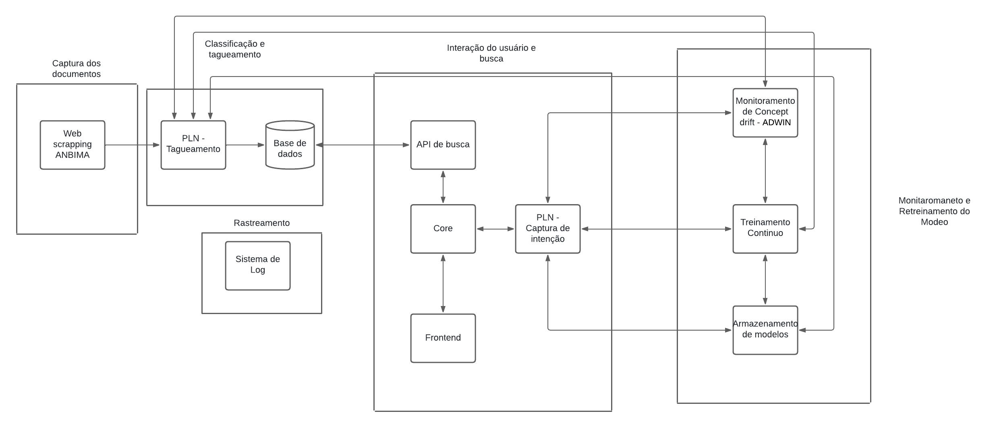

# Introdução 

O problema de falta de atualização em sistemas de aprendizado de máquina, especialmente em modelos conversacionais, está relacionado ao fenômeno chamado "concept drift". Isso ocorre quando os padrões dos dados que alimentam o modelo mudam ao longo do tempo, tornando o modelo menos eficaz. No contexto de sistemas de PLN que interagem com documentos regulatórios, como no projeto com o Bank of America(BofA), essas mudanças podem ser ainda mais rápidas devido a alterações nas normativas e regulamentações financeiras.

O aprendizado contínuo surge como uma solução para manter os modelos atualizados e relevantes, permitindo que eles aprendam continuamente à medida que novos dados são gerados ou que ocorrem mudanças nos padrões de uso. Esse paradigma é especialmente importante em cenários onde as intenções e as consultas dos usuários podem variar conforme surgem novos contextos e regulamentações.

# Diagrama da Arquitetura

**Captura de Dados:** Captura os novos documentos através de Webscrapping. 

**Classificação e Tagueamento:** Classifica os documentos e os tagueia de acordo com seu conteudo.

**Monitoramento de Concept Drift:** Acompanha as variações nos dados e alerta o sistema quando há mudanças significativas que podem impactar a performance do modelo.
Treinamento Contínuo: Quando o concept drift é detectado, esse módulo re-treina o modelo com base nas novas informações, garantindo a adaptabilidade do sistema.

**Armazenamento de Modelos:** Gerencia versões dos modelos, permitindo a transição entre versões antigas e novas de forma segura e eficiente.

**Core:** Facilita a comunicação entre o front e os módulos internos, assegurando que as consultas sejam processadas com os modelos mais recentes.

**PLN - Captura de Intenção:** Identifica as intenções do usuário a partir das consultas feitas ao sistema.

**API de Busca:** Ajusta as consultas aos documentos de acordo com as novas regras, intenções e informações inseridas pelo usuário, baseando-se no modelo atualizado.

# Conclusão
A implementação de um paradigma de aprendizado contínuo em um sistema conversacional voltado para regulamentações financeiras requer um esforço técnico significativo. No entanto, essa abordagem garante que o sistema se adapte constantemente às mudanças, mantendo-se relevante e preciso. O maior desafio reside na implementação de um monitoramento eficiente do concept drift e na capacidade de re-treinamento contínuo sem impactar a performance em tempo real do modelo.

# Referências Bibliográficas
SILVA, João. "Learning continuously: challenges and strategies for maintaining up-to-date models". Machine Learning Journal, 2020.